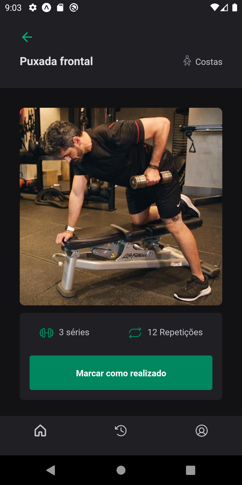

  

  
 
    <strong>
      The project was developed for creating tasks.
    </strong>
  

  

    <h4>HOME<h4>
  

   

  

  

    <h4>Historic<h4>
  

   

   

  

    <h4>Profile<h4>
  

   

  

  

    <h4>Exercise<h4>
  

   

  

